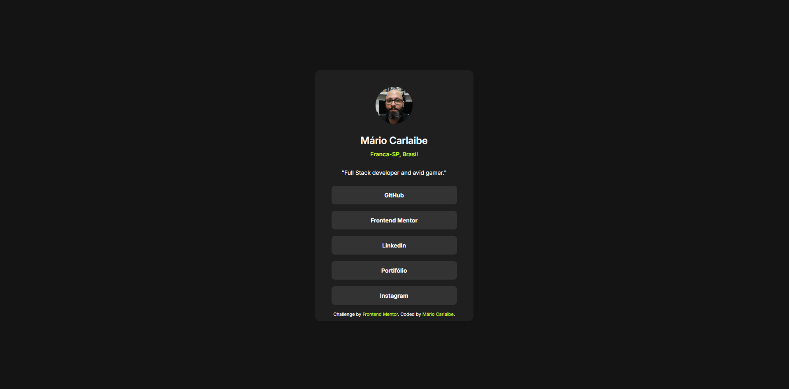

# Frontend Mentor - Solução de perfil de links sociais

Esta é uma solução para o [desafio de perfil de links sociais no Frontend Mentor](https://www.frontendmentor.io/challenges/social-links-profile-UG32l9m6dQ). Os desafios do Frontend Mentor ajudam você a melhorar suas habilidades de codificação construindo projetos realistas.

## Índice

- [O desafio](#o-desafio)
- [Captura de tela](#captura-de-tela)
- [Links](#links)
- [Criado com](#construído-com)
- [O que aprendi](#o-que-aprendi)

### O desafio

Os usuários devem ser capazes de:

- Criar uma pagina de links de redes sociais e aplicar um hover quando passar o mouse por cima dos botões.

### Captura de tela

### Links

- URL da solução: https://github.com/MarioCarlaibe/social-links-profile-main
- URL do site ativo: https://mariocarlaibe.github.io/social-links-profile-main/

### Criado com

- HTML5
- CSS
- Flexbox

### O que aprendi

Aprendi que eu estava cometendo o erro de colocar muitas div's. eu pensava que era necessário criar uma div para cada elemento. mas descobri que não era preciso. talvez esse era o erro do porque algumas coisas não estavam funcionando bem.

